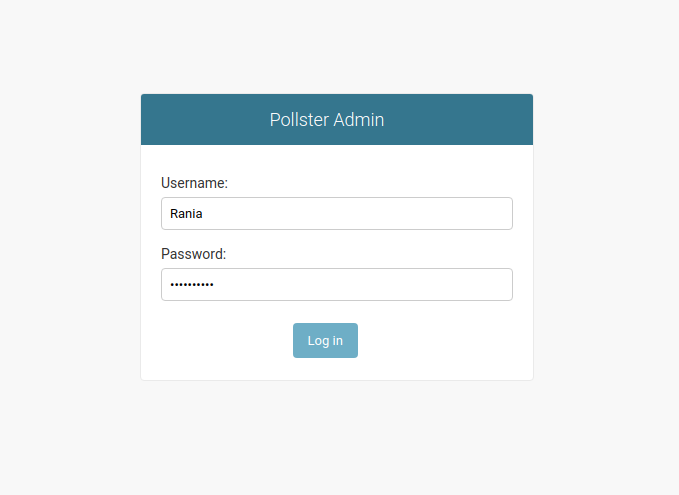
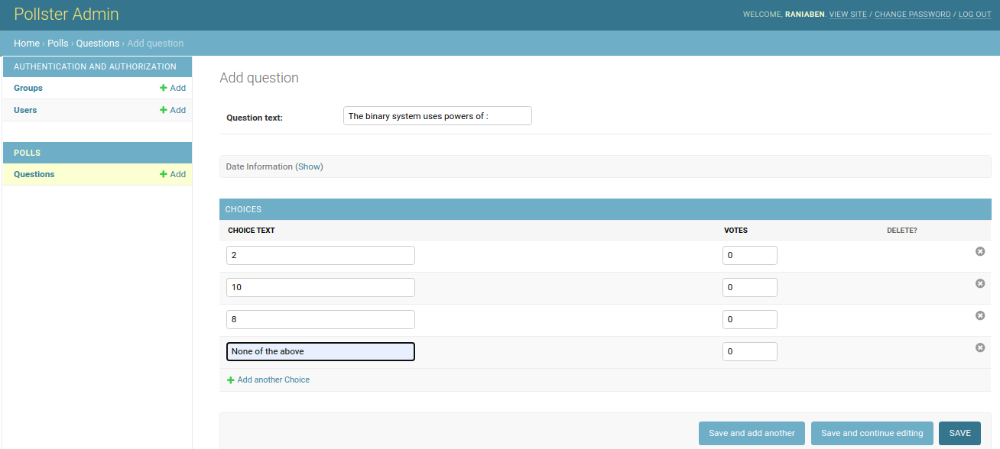

# pollster

Minimalist application to create polls with questions / choices, with an administrator side, built with Python, Django, HTML and Bootstrap. Running on localhost.

## Screenshots

Here are some screenshots.

### Administration Area

<table>
  <tr>
    <td><b>Login Interface</b></td>
    <td><b>Welcome Interface</b></td>
  </tr>
  <tr>
    <td></td>
    <td></td>
  </tr>
  <tr>
    <td><b>Users List Interface</b></td>
    <td> <b>Questions List Interface</b> </td>
  </tr>
  <tr>
    <td></td>
    <td></td>
  </tr>
  <tr>
    <td><b>Add Question Interface</b> </td>
    <td><b>Question History Interface</b></td>
  </tr>
  <tr>
    <td></td>
    <td></td>
  </tr>
  <tr>
    <td><b>Add User Interface</b> </td>
  </tr>
  <tr>
    <td></td>
  </tr>
 </table>

### User Area

<table>
  <tr>
    <td><b>Welcome Interface</b></td>
  </tr>
  <tr>
    <td></td>
  </tr>
  <tr>
    <td> <b>Polls Interface</b> </td>
  </tr>
  <tr>
    <td></td>
  </tr>
  <tr>
    <td><b>Voting Interface</b> </td>
  </tr>
  <tr>
    <td></td>
  </tr>
  <tr>
    <td><b>Results Interface</b> </td>
  </tr>
  <tr>
    <td></td>
  </tr>
 </table>
 
## Installation

### Install dependencies

Open your terminal, access the project's folder path. You can install **Django** globally on your system by running : 

```bash
pip install django
```

But, it is preferable to set a Virtual Environment (VE) for each Python project that you create on your system, so we are gonna use **pipenv** to do that. Supposing you have ***Python*** installed ( Preferably **Python 3.7** ), run the following command to install **pipenv**:

```bash
pip install pipenv
```
Now, create a Virtual Environment : 

```bash
pipenv shell
```

Now, any package we install is gonna be saved in this VE rather than globally on our system.

#### Note

- If you are on [VSCode](https://code.visualstudio.com/), close the current terminal. 
- Make sure that you are using the right ***Python Interpreter***. 
- To check the interpreter, check what's writter in the blue downbar of ***VSCode***; if your VE is mentioned, then it's the correct interpreter. 
- If your not using the right interpreter, access the settings of ***VSCode***, search for 'Python Interpreter', then select your VE path from the list.

Since the previous command generates a ***Pipfile*** including all package names, next time When you open the project, to install all the packages needed,
all you have to do is run :

```bash
pipenv install
```

( kind of the same principle as ***npm install*** in ***React.js*** (package.json) ).

### Create an administrator

You can use the already present administrator account :
- Name : raniaben
- Address : raniaben@gmail.com
- Password : raniaben

Or, create your own administrator account by running the command : 

```bash 
cd pollster
```

```bash 
python manage.py createsuperuser
```
Make sure to not forget your credentials.

### Manage Database

We adopted the default database which is [Sqlite](https://www.sqlite.org/index.html). You can change it if you want, in the project's settings file.

## Run the project

To run the project, make sure you are in the right path ( ***pollster folder*** ), then run :

```bash
python manage.py runserver
```

A localhost link will be shown in the terminal, access the link to view the application's interface. If you desire to change the port number, you can do so by adding the port number to the end of the previous command :

```bash
python manage.py runserver port-number
```

## Encountered Problems (Solutions)

If you have a problem with the package ***django.urls*** when running the project, you will have to update your Django version ( >= 2.0 ) like so :

```bash
pip install --upgrade django
```

## Credits
[Brad Traversy](https://github.com/bradtraversy)
